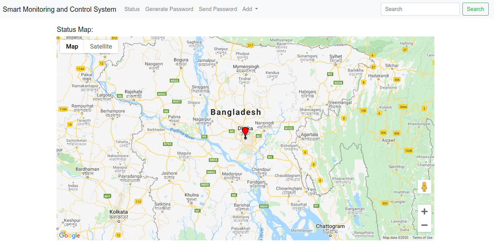

# Project Detail
**Description:** Question papers of public examinations are transported using trunks. These trunks needs security so that no one can open them without authorization. Moreover, tracking their way to the destination is also necessary so that any unwanted situation can be checked in the way.

**Our approach:** Our system uses GPS trackers to track real time position of the trunks. Each trunk will have an electronic lock. It can be unlocked by inserting pins that will be validated by a global server.

# Arduino File
The Arduino script is on the `arduino` folder.

#  Screenshots
Add a tracker

  
Main Dashboard

  
A tracker's details

  
All the unreached trackers' status

  
Generating unlocking password for the trackers

  
Sending unlocking password to the trackers contact phone

  
Update a tracker's info

  
View a tracker's position list as well as warnings

  
